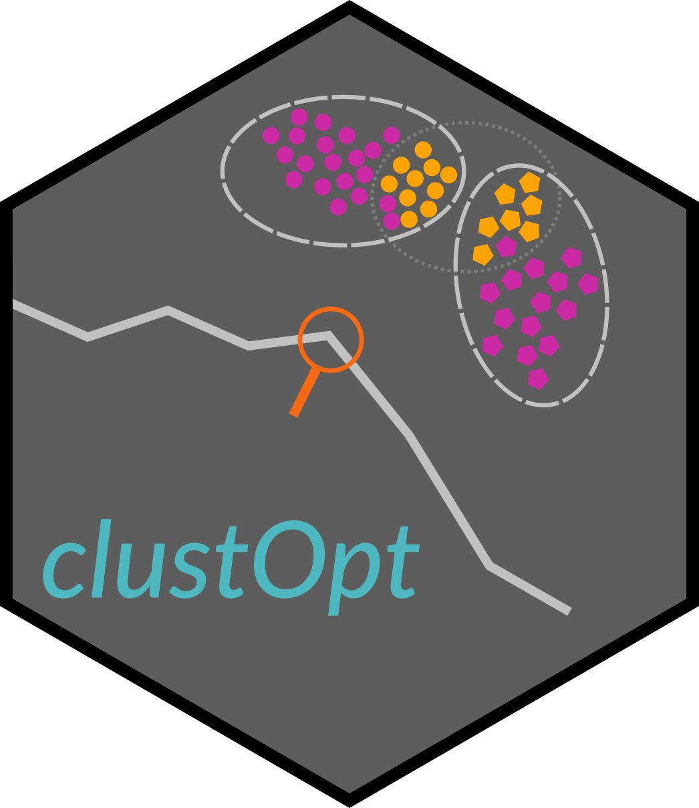
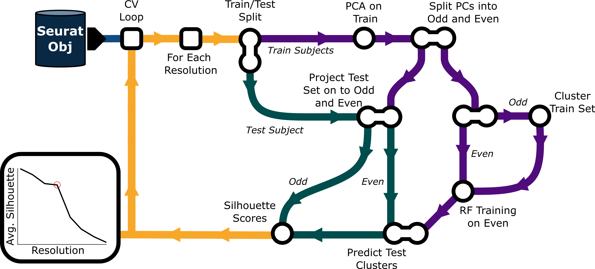
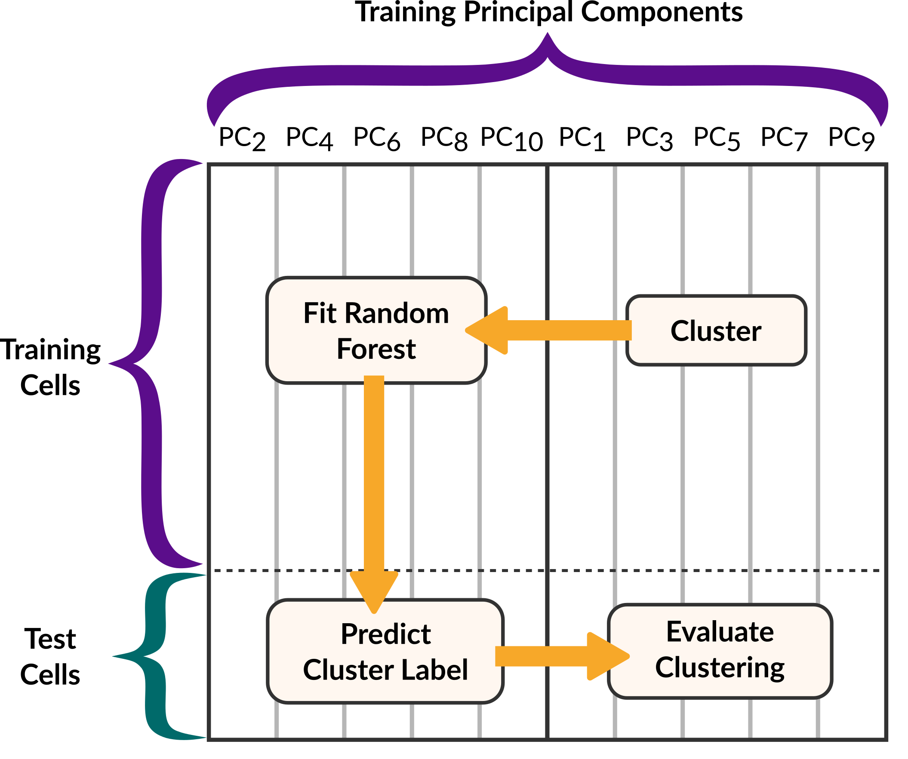

# clustOpt 


<!-- badges: start -->
[](https://github.com/gladstone-institutes/clustOpt/actions/workflows/R-CMD-check.yaml)
[](https://lifecycle.r-lib.org/articles/stages.html#experimental)
<!-- badges: end -->
   

*Authors: Natalie Gill, Min-Gyoung Shin, Ayushi Agrawal, and Reuben Thomas*


Selecting the clustering resolution parameter for Louvain clustering in scRNA-seq is often based on the concentration of expression of cell type marker genes within clusters, increasing the parameter as needed to resolve clusters with mixed cell type gene signatures. This approach is however subjective in situations where one does not have complete knowledge of condition/disease associated cell-types in the context of novel biology, it is time-consuming and has the potential to bias the final clustering results due to individual transcriptomic heterogeneity, and subject-specific differences in cell composition.

clustOpt improves the reproducibility of modularity-based clustering in multi-subject experiments by using a combination of subject-wise cross-validation, feature splitting, random forests, and measures of cluster quality using the silhouette metric to guide the selection of the resolution parameter. The package supports both single-cell RNA-seq and CyTOF data with optimized preprocessing pipelines for each data type. 

## clustOpt Algorithm

 </a>


To avoid the issue of data leakage we cluster and evaluate in the odd PC space while training and predicting in the even PC space.

<p align="center">

</p>

## Installation

### Standard Installation

Install the development version from GitHub using `devtools`:

```r
# Install devtools if needed
if (!requireNamespace("devtools", quietly = TRUE)) {
  install.packages("devtools")
}

# Install clustOpt
devtools::install_github("gladstone-institutes/clustOpt")
```

### Full Installation with Optional Dependencies

For complete functionality including large dataset support:

```r
# Install core package
devtools::install_github("gladstone-institutes/clustOpt")

# Install optional dependencies for large datasets
if (!requireNamespace("BiocManager", quietly = TRUE)) {
  install.packages("BiocManager")
}
BiocManager::install("BPCells")  # For on-disk matrix operations

# Verify installation
library(clustOpt)
packageVersion("clustOpt")
```

### Docker Image

For convienience we maintain a clustOpt docker image:

```
docker pull natalie23gill/clustopt:1.0
```


### Troubleshooting Installation

If you encounter GitHub authentication issues:

```r
# Set up Git configuration
install.packages("usethis")
usethis::use_git_config(user.name = "YourName", user.email = "your@email.com")

# Generate GitHub token (opens browser)
usethis::create_github_token()

# Set the token (paste when prompted)
credentials::set_github_pat()

# Try installation again
devtools::install_github("gladstone-institutes/clustOpt")
```

For permission or dependency issues:
```r
# Install with dependencies
devtools::install_github("gladstone-institutes/clustOpt", dependencies = TRUE)

# Or install system dependencies first on Linux
# sudo apt-get update
# sudo apt-get install libcurl4-openssl-dev libssl-dev libxml2-dev
```

## Features

- **Objective resolution selection** using cross-validation and silhouette scores
- **Prevents data leakage** by splitting principal components  
- **Supports scRNA-seq and CyTOF** with optimized preprocessing
- **Scales to large datasets** Automatically reduces the size of large datasets (>200k cells) with Seurat's leverage score based sketching 

## Quick Start

```r
library(clustOpt)

# Basic usage for scRNA-seq
results <- clust_opt(
  input = seurat_obj,
  ndim = 50,
  subject_ids = "donor_id",
  res_range = c(0.1, 0.2, 0.4, 0.6, 0.8, 1.0)
)

# CyTOF data (ndim should equal the number of markers in the panel)
cytof_results <- clust_opt(
  input = cytof_seurat,
  ndim = 30,
  dtype = "CyTOF",
  subject_ids = "donor_id"
)

# Large datasets (>200k cells)
large_results <- clust_opt(
  input = large_seurat,
  sketch_size = 20000,
  on_disk = TRUE
)

# View results
summary_results <- sil_summary(results)
plots <- create_sil_plots(results)
```

## Key Parameters

- `subject_ids`: Metadata column with subject identifiers (≥3 subjects, ≥50 cells each)
- `ndim`: Principal components to use (30-50 for scRNA-seq, 20-30 for CyTOF)
- `dtype`: Data type - `"scRNA"`  or `"CyTOF"` (assumes arcsinh normalized values in the counts layer)
- `sketch_size`: Cells for sketching large datasets (auto: 10% if >200k cells)
- `within_batch`: Batch column for within-batch cross-validation
- `on_disk`: Use BPCells for memory efficiency

## Troubleshooting

**"fewer than 3 samples" error**: Check `table(seurat_obj@meta.data$your_subject_column)` - ensure ≥3 subjects with ≥50 cells each

**Memory issues**: Use `sketch_size = 10000` and `on_disk = TRUE` 

**Slow performance**: Reduce `num_trees`,`res_range`, or sketch to a smaller size - too few cells will lead to a flat silhouette score curve

**Requirements**: R ≥ 4.4.0, Seurat (>= 5.3.0), install BPCells for large datasets

## Citation

```
Gill N, Shin MG, Agrawal A, Thomas R (2025). Optimizing Clustering Resolution 
for Multi-subject Single Cell Studies. Presented at Intelligent Systems for 
Molecular Biology (ISMB), July 23, 2025. R package version 1.0. 
https://github.com/gladstone-institutes/clustOpt
```

## Support

- Documentation: `?clust_opt`  
- Issues: [GitHub Issues](https://github.com/gladstone-institutes/clustOpt/issues)
- License: MIT

