# clustOpt: Quickstart Guide

``` r
library(Seurat)
# Only v5 Seurat Assays are supported
options(Seurat.object.assay.version = "v5")
# Increase future globals limit for large datasets
options(future.globals.maxSize = 2e9)  # 2GB limit
library(dplyr)
library(tidyr)
library(ggplot2)
library(clustOpt)
library(future)
set.seed(42)
```

Read in the tutorial dataset. This data was generated from the [Asian
Immune Diversity Atlas](https://doi.org/10.1101/2024.06.30.601119) (data
freeze v1). It contains only B cells, Monocytes, and NK cells from 10
donors which have been sketched to a total of 1000 cells using the
leverage score based method of Seurat’s SketchData function.

``` r
input <- readRDS(
  system.file(
    "extdata",
    "1000_cell_sketch_10_donors_3_celltypes_AIDA.rds",
    package = "clustOpt"
  )
)
```

``` r
input@meta.data |>
  summarize(
    Donors = n_distinct(donor_id),
    Celltypes = n_distinct(broad_cell_type),
    `Cell Subtypes` = n_distinct(author_cell_type),
    Ethnicities = n_distinct(Ethnicity_Selfreported),
    Countries = n_distinct(Country)
  ) |>
  pivot_longer(cols = everything(), names_to = "Metric", values_to = "Count")
#> # A tibble: 5 × 2
#>   Metric        Count
#>   <chr>         <int>
#> 1 Donors           10
#> 2 Celltypes         3
#> 3 Cell Subtypes    10
#> 4 Ethnicities       5
#> 5 Countries         3
```

``` r
input <- input |>
  SCTransform(verbose = FALSE) |>
  RunPCA(verbose = FALSE)
```

``` r
ElbowPlot(input, ndims = 50)
```


``` r
input <- RunUMAP(input, dims = 1:20, verbose = FALSE)

DimPlot(input,
  group.by = "donor_id",
  pt.size = .8
) +
  coord_fixed()
```

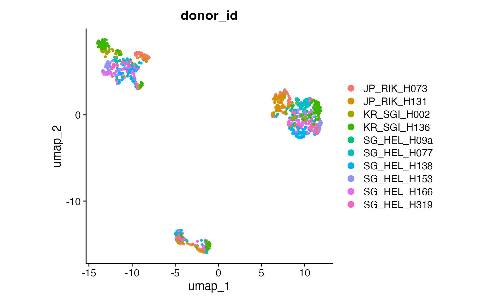

``` r
DimPlot(input,
  group.by = "broad_cell_type",
  pt.size = .8
) +
  coord_fixed()
```

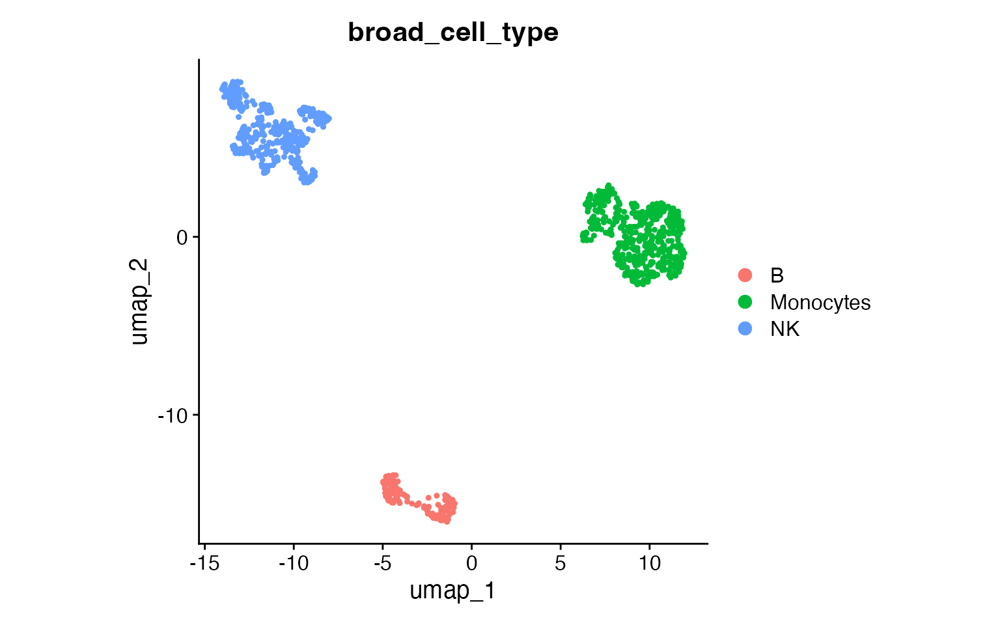

``` r
DimPlot(input,
  group.by = "author_cell_type",
  pt.size = .8
) +
  coord_fixed()
```

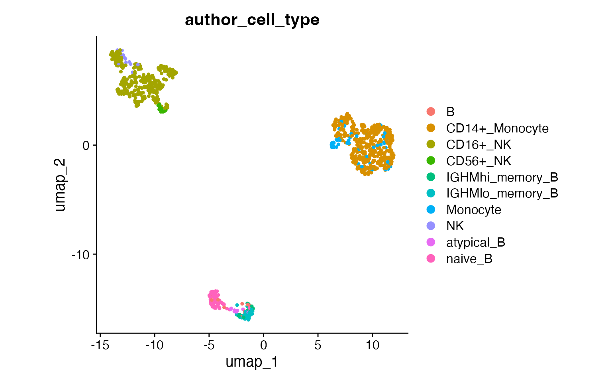

## How clustOpt Works

clustOpt uses subject-wise leave-one-out cross-validation to find
clustering resolutions that generalize across biological replicates:

1.  **PC Splitting**: Principal components are split into two
    independent sets (odd: PC1, PC3, PC5… and even: PC2, PC4, PC6…)
2.  **Training**: For each held-out subject, a Random Forest is trained
    on one PC set to predict cluster assignments
3.  **Evaluation**: Clustering quality metrics are calculated on the
    opposite PC set

This separation ensures that the evaluation is performed on data
independent from what was used for training, preventing overfitting and
providing a more honest assessment of clustering reproducibility.

## Running clustOpt

Subject-wise cross validation is parallelized with `future` and
`future.batchtools` can be used for HPC job schedulers. For details on
which plan to use for your setup, see the future package documentation.
The code below requires a large amount of RAM (32 GB recommended) and 10
cores to run in about 15 minutes.

``` r
plan("multisession", workers = 11)

cv_results <- clust_opt(input,
  subject_ids = "donor_id",
  ndim = 20,
  verbose = 1,
  train_with = "even"
) |>
  progressr::with_progress() # Optional, just adds progress bar
#> ── clustOpt ────────────────────────────────────────────────────────────────────
#> ℹ Input is small enough to run with all cells
#> ✔ Using 10 subject(s) with at least 50 cells:
#> • JP_RIK_H073 (100 cells)
#> • JP_RIK_H131 (83 cells)
#> • KR_SGI_H002 (76 cells)
#> • KR_SGI_H136 (127 cells)
#> • SG_HEL_H09a (52 cells)
#> • SG_HEL_H077 (147 cells)
#> • SG_HEL_H138 (130 cells)
#> • SG_HEL_H153 (85 cells)
#> • SG_HEL_H166 (123 cells)
#> • SG_HEL_H319 (77 cells)
#> ℹ Found 110 combinations of test subject and resolution
#> 
#> ── Holdout subject: JP_RIK_H073 ──
#> 
#> ✔ [prep_train] 38.3s
#> ✔ [prep_test] 65.0s
#> ✔ [RunPCA + split_pca_dimensions] 0.1s
#> ✔ [FindNeighbors + FindClusters] 32.4s
#> ✔ [project_pca] 0.0s
#> ℹ train: 900 cells, test: 100 cells, 10 PCs, 11 resolutions
#> ✔ [precompute SNN] 0.3s
#> ✔ [precompute dist] 0.0s (100 cells)
#> ✔ [future_lapply RF] 3.5s (11 resolutions)
#> ────────────────────────────────────────────────────────── JP_RIK_H073 139.5s ──
#> 
#> ── Holdout subject: JP_RIK_H131 ──
#> 
#> ✔ [prep_train] 29.3s
#> ✔ [prep_test] 51.1s
#> ✔ [RunPCA + split_pca_dimensions] 0.1s
#> ✔ [FindNeighbors + FindClusters] 8.9s
#> ✔ [project_pca] 0.0s
#> ℹ train: 917 cells, test: 83 cells, 10 PCs, 11 resolutions
#> ✔ [precompute SNN] 0.5s
#> ✔ [precompute dist] 0.0s (83 cells)
#> ✔ [future_lapply RF] 2.9s (11 resolutions)
#> ─────────────────────────────────────────────────────────── JP_RIK_H131 92.8s ──
#> 
#> ── Holdout subject: KR_SGI_H002 ──
#> 
#> ✔ [prep_train] 21.0s
#> ✔ [prep_test] 33.5s
#> ✔ [RunPCA + split_pca_dimensions] 0.1s
#> ✔ [FindNeighbors + FindClusters] 10.1s
#> ✔ [project_pca] 0.0s
#> ℹ train: 924 cells, test: 76 cells, 10 PCs, 11 resolutions
#> ✔ [precompute SNN] 0.4s
#> ✔ [precompute dist] 0.0s (76 cells)
#> ✔ [future_lapply RF] 3.0s (11 resolutions)
#> ─────────────────────────────────────────────────────────── KR_SGI_H002 68.1s ──
#> 
#> ── Holdout subject: KR_SGI_H136 ──
#> 
#> ✔ [prep_train] 19.6s
#> ✔ [prep_test] 33.3s
#> ✔ [RunPCA + split_pca_dimensions] 0.1s
#> ✔ [FindNeighbors + FindClusters] 10.7s
#> ✔ [project_pca] 0.0s
#> ℹ train: 873 cells, test: 127 cells, 10 PCs, 11 resolutions
#> ✔ [precompute SNN] 0.4s
#> ✔ [precompute dist] 0.0s (127 cells)
#> ✔ [future_lapply RF] 2.6s (11 resolutions)
#> ─────────────────────────────────────────────────────────── KR_SGI_H136 66.8s ──
#> 
#> ── Holdout subject: SG_HEL_H09a ──
#> 
#> ✔ [prep_train] 19.5s
#> ✔ [prep_test] 32.9s
#> ✔ [RunPCA + split_pca_dimensions] 0.1s
#> ✔ [FindNeighbors + FindClusters] 11.2s
#> ✔ [project_pca] 0.0s
#> ℹ train: 948 cells, test: 52 cells, 10 PCs, 11 resolutions
#> ✔ [precompute SNN] 0.4s
#> ✔ [precompute dist] 0.0s (52 cells)
#> ✔ [future_lapply RF] 4.1s (11 resolutions)
#> ─────────────────────────────────────────────────────────── SG_HEL_H09a 68.3s ──
#> 
#> ── Holdout subject: SG_HEL_H077 ──
#> 
#> ✔ [prep_train] 19.6s
#> ✔ [prep_test] 36.6s
#> ✔ [RunPCA + split_pca_dimensions] 0.1s
#> ✔ [FindNeighbors + FindClusters] 10.2s
#> ✔ [project_pca] 0.0s
#> ℹ train: 853 cells, test: 147 cells, 10 PCs, 11 resolutions
#> ✔ [precompute SNN] 0.4s
#> ✔ [precompute dist] 0.0s (147 cells)
#> ✔ [future_lapply RF] 2.5s (11 resolutions)
#> ─────────────────────────────────────────────────────────── SG_HEL_H077 69.5s ──
#> 
#> ── Holdout subject: SG_HEL_H138 ──
#> 
#> ✔ [prep_train] 20.4s
#> ✔ [prep_test] 35.5s
#> ✔ [RunPCA + split_pca_dimensions] 0.1s
#> ✔ [FindNeighbors + FindClusters] 10.4s
#> ✔ [project_pca] 0.0s
#> ℹ train: 870 cells, test: 130 cells, 10 PCs, 11 resolutions
#> ✔ [precompute SNN] 0.4s
#> ✔ [precompute dist] 0.0s (130 cells)
#> ✔ [future_lapply RF] 2.6s (11 resolutions)
#> ─────────────────────────────────────────────────────────── SG_HEL_H138 69.3s ──
#> 
#> ── Holdout subject: SG_HEL_H153 ──
#> 
#> ✔ [prep_train] 21.6s
#> ✔ [prep_test] 35.3s
#> ✔ [RunPCA + split_pca_dimensions] 0.1s
#> ✔ [FindNeighbors + FindClusters] 10.3s
#> ✔ [project_pca] 0.0s
#> ℹ train: 915 cells, test: 85 cells, 10 PCs, 11 resolutions
#> ✔ [precompute SNN] 0.4s
#> ✔ [precompute dist] 0.0s (85 cells)
#> ✔ [future_lapply RF] 2.8s (11 resolutions)
#> ─────────────────────────────────────────────────────────── SG_HEL_H153 70.5s ──
#> 
#> ── Holdout subject: SG_HEL_H166 ──
#> 
#> ✔ [prep_train] 21.0s
#> ✔ [prep_test] 32.7s
#> ✔ [RunPCA + split_pca_dimensions] 0.1s
#> ✔ [FindNeighbors + FindClusters] 10.9s
#> ✔ [project_pca] 0.0s
#> ℹ train: 877 cells, test: 123 cells, 10 PCs, 11 resolutions
#> ✔ [precompute SNN] 0.4s
#> ✔ [precompute dist] 0.0s (123 cells)
#> ✔ [future_lapply RF] 2.5s (11 resolutions)
#> ─────────────────────────────────────────────────────────── SG_HEL_H166 67.7s ──
#> 
#> ── Holdout subject: SG_HEL_H319 ──
#> 
#> ✔ [prep_train] 19.7s
#> ✔ [prep_test] 33.1s
#> ✔ [RunPCA + split_pca_dimensions] 0.1s
#> ✔ [FindNeighbors + FindClusters] 9.2s
#> ✔ [project_pca] 0.0s
#> ℹ train: 923 cells, test: 77 cells, 10 PCs, 11 resolutions
#> ✔ [precompute SNN] 0.4s
#> ✔ [precompute dist] 0.0s (77 cells)
#> ✔ [future_lapply RF] 2.8s (11 resolutions)
#> ─────────────────────────────────────────────────────────── SG_HEL_H319 65.4s ──
#> ✔ [total pipeline] 778.0s
#> ────────────────────────────────────────────────────────────────────────────────

# Shut down stray workers
plan("sequential")
```

## Plotting the silhouette score distributions

``` r
plots <- create_sil_plots(cv_results |> drop_na())

plots[[1]]
```

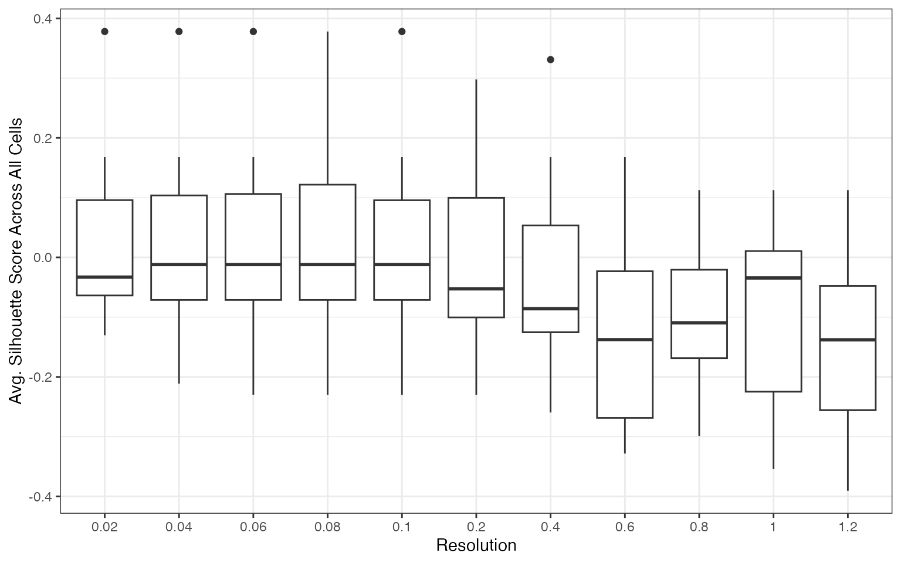

``` r
plots[[2]]
```

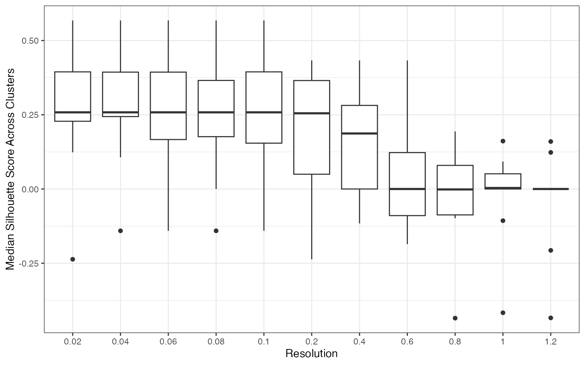

``` r
plots[[3]]
```

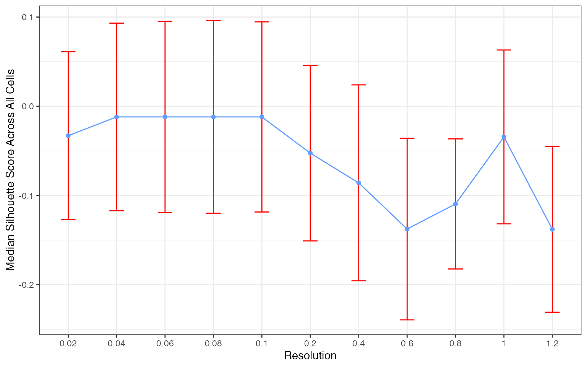

``` r
plots[[4]]
```

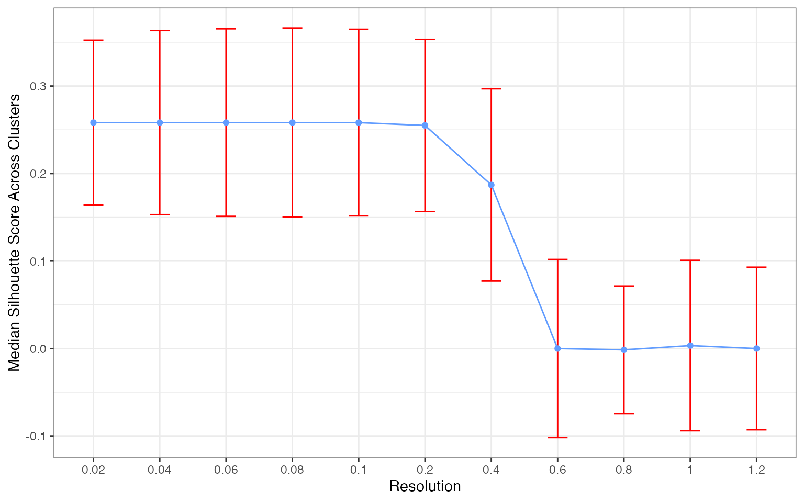

The silhouette score distribution shows how consistently clusters are
separated across subjects at each resolution. Key patterns to look for:

- **Declining scores at higher resolutions** indicate over-clustering,
  where cells are forced into clusters that don’t represent distinct
  populations
- **Low variance across subjects** (narrow boxes) indicates reproducible
  clustering
- **Local maxima** may indicate resolutions that capture natural
  biological structure

The optimal resolution typically shows high median silhouette scores
with low variance across subjects, suggesting that the clustering
captures cell populations that are consistently distinguishable
regardless of which subjects are used for training.

## Additional Quality Metrics

> **Note:** We currently recommend **silhouette scores** for resolution
> selection. The additional metrics below are still undergoing
> benchmarking across different experimental settings.

[`clust_opt()`](https://gladstone-institutes.github.io/clustOpt/reference/clust_opt.md)
also computes the following at each resolution:

| Metric | Measures | Better |
|----|----|----|
| **avg_width** | Silhouette score — cluster separation (recommended) | Higher |
| **KLdivergence** | KL divergence of cluster proportions (experimental) | Lower |
| **Hellinger** | Hellinger distance of cluster proportions (experimental) | Lower |
| **modularity** | Graph modularity of cluster assignments (experimental) | Higher |

``` r
head(cv_results)
#>   resolution test_sample  avg_width cluster_median_widths n_predicted_clusters
#> 1       0.02 JP_RIK_H073 -0.0278377             0.2201124                    2
#> 2       0.04 JP_RIK_H073 -0.2112706             0.2411615                    3
#> 3       0.06 JP_RIK_H073 -0.2299488             0.0000000                    3
#> 4       0.08 JP_RIK_H073 -0.2299488             0.0000000                    3
#> 5       0.10 JP_RIK_H073 -0.2299488             0.0000000                    3
#> 6       0.20 JP_RIK_H073 -0.2299488             0.0000000                    3
#>   min_predicted_cell_per_cluster max_predicted_cell_per_cluster      mse
#> 1                             15                             85 231.3450
#> 2                              2                             86 229.7787
#> 3                              1                             87 230.9151
#> 4                              1                             87 230.9151
#> 5                              1                             87 230.9151
#> 6                              0                             87 230.9151
#>        mad KLdivergence Hellinger modularity
#> 1 22.93898    0.3296330 0.2704394  0.1303816
#> 2 22.73838    0.6291037 0.3341506  0.1218185
#> 3 22.63583    0.7635659 0.3554826  0.1195556
#> 4 22.63583    0.7635659 0.3554826  0.1195556
#> 5 22.63583    0.7635659 0.3554826  0.1195556
#> 6 22.63583    0.6373649 0.3357823  0.1195556
```

``` r
cv_results |>
  drop_na() |>
  pivot_longer(cols = c(KLdivergence, Hellinger, modularity),
               names_to = "metric", values_to = "value") |>
  ggplot(aes(x = as.factor(resolution), y = value)) +
  geom_boxplot() +
  facet_wrap(~metric, scales = "free_y", ncol = 1) +
  theme_bw() +
  labs(x = "Resolution", y = NULL)
```

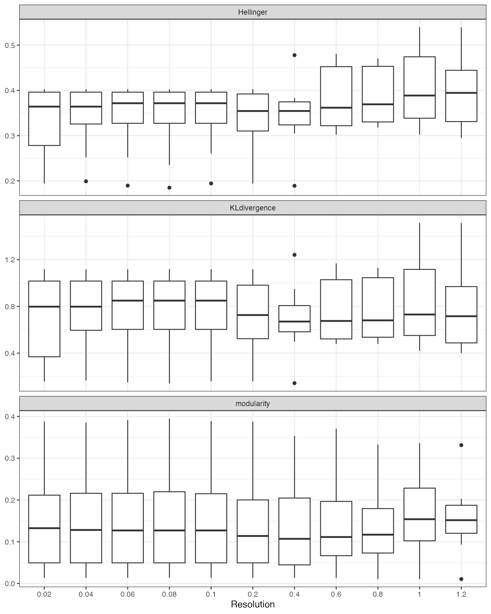

## Suggesting a Resolution

[`suggest_resolution()`](https://gladstone-institutes.github.io/clustOpt/reference/suggest_resolution.md)
provides two approaches for identifying optimal resolutions:

- **`"rank"`** (default): Ranks all tested resolutions by aggregating
  their median metric values. Works with any number of subjects.

- **`"local_optima"`**: Filters to resolutions with reproducible
  clustering (low Hellinger distance across subjects), then ranks the
  filtered set using both rank aggregation and curvature-based detection
  of local optima in the metric curves. Recommended when you have \>=10
  subjects, as the Hellinger filter thresholds scale automatically with
  the number of subjects.

[`plot_rank_metrics()`](https://gladstone-institutes.github.io/clustOpt/reference/plot_rank_metrics.md)
shows the per-metric ranks and
[`plot_mean_rank()`](https://gladstone-institutes.github.io/clustOpt/reference/plot_mean_rank.md)
shows the aggregate.

``` r
rankings <- suggest_resolution(cv_results)
rankings
#> # A tibble: 11 × 12
#>    resolution median_score median_KLD_score median_Hell_score
#>         <dbl>        <dbl>            <dbl>             <dbl>
#>  1       0.04      -0.0120            0.798             0.364
#>  2       0.02      -0.0330            0.798             0.364
#>  3       0.2       -0.0526            0.726             0.354
#>  4       0.4       -0.0859            0.670             0.354
#>  5       1         -0.0344            0.730             0.389
#>  6       0.6       -0.138             0.675             0.362
#>  7       0.8       -0.110             0.680             0.369
#>  8       0.06      -0.0120            0.849             0.372
#>  9       0.08      -0.0120            0.849             0.372
#> 10       0.1       -0.0120            0.849             0.372
#> 11       1.2       -0.138             0.716             0.394
#> # ℹ 8 more variables: median_modularity_score <dbl>,
#> #   standard_error_Hell_score <dbl>, upper_Hell_95ci <dbl>, rank_sil <dbl>,
#> #   rank_kl <dbl>, rank_hellinger <dbl>, rank_modularity <dbl>, mean_rank <dbl>
```

``` r
plot_rank_metrics(rankings)
```

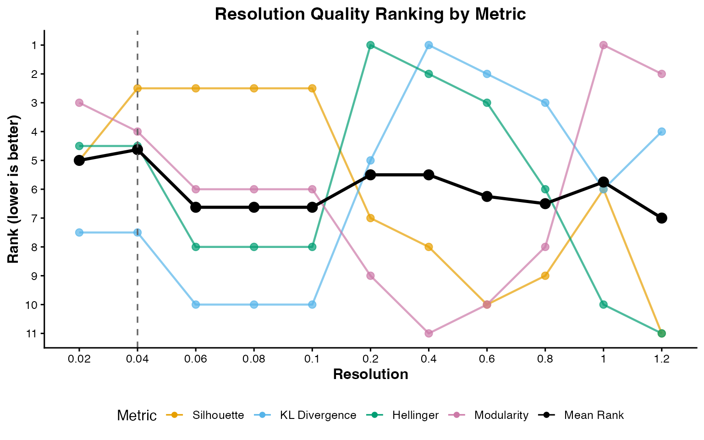

``` r
plot_mean_rank(rankings)
```

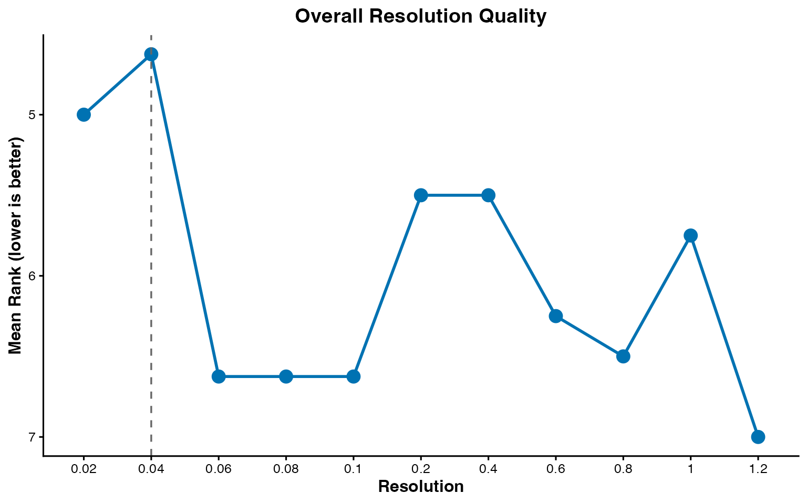

This tutorial uses the default `"rank"` method. The example dataset
contains only 3 well-separated celltypes, so a simple rank aggregation
is sufficient. For real-world datasets with a denser resolution grid and
more ambiguous cluster structure, `method = "local_optima"` can better
identify resolutions that sit at natural inflection points in the metric
curves. See
[`?suggest_resolution`](https://gladstone-institutes.github.io/clustOpt/reference/suggest_resolution.md)
for details.

## Comparison to the cell annotations

``` r
input <- FindNeighbors(input, dims = 1:20, verbose = FALSE)
input <- FindClusters(input, resolution = 0.04)
#> Modularity Optimizer version 1.3.0 by Ludo Waltman and Nees Jan van Eck
#> 
#> Number of nodes: 1000
#> Number of edges: 31348
#> 
#> Running Louvain algorithm...
#> Maximum modularity in 10 random starts: 0.9855
#> Number of communities: 3
#> Elapsed time: 0 seconds

DimPlot(input,
  group.by = "seurat_clusters",
  pt.size = .8
)
```

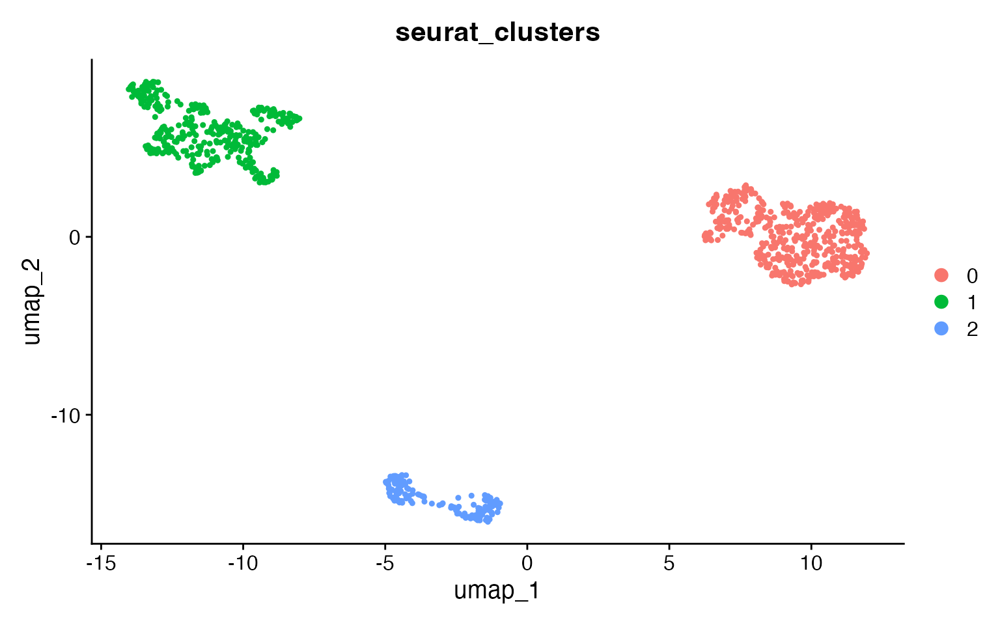

At the reproducible resolution there are 3 clusters, corresponding to
the 3 celltypes. Use
[`adjusted_rand_index()`](https://gladstone-institutes.github.io/clustOpt/reference/adjusted_rand_index.md)
to compare any two metadata columns:

``` r
adjusted_rand_index(input,
  meta1 = "seurat_clusters",
  meta2 = "broad_cell_type"
)
#> [1] 1
adjusted_rand_index(input,
  meta1 = "seurat_clusters",
  meta2 = "author_cell_type"
)
#> [1] 0.8056774
```

## Larger Datasets

Due to the resource requirements of clustOpt, we recommend running it in
Rscripts with the `future` plan set to “multicore” instead of
“multisession” and if possible using `future.batchtools`. Additionally
we provide a wrapper around `Seurat`’s SketchData using the leverage
score method to reduce the size of the input data to clustOpt.

``` r
input <- leverage_sketch(input, sketch_size = 100)
#> ℹ Sketching scRNA data: 1000 -> 100 cells
#> ℹ Removing previously calculated leverage scores...
#> ℹ Normalizing scRNA-seq data...
#> ℹ Finding variable features for scRNA-seq data...
#> Renaming default assay from sketch to RNA
input
#> An object of class Seurat 
#> 13855 features across 100 samples within 1 assay 
#> Active assay: RNA (13855 features, 2000 variable features)
#>  3 layers present: counts, data, scale.data
```
